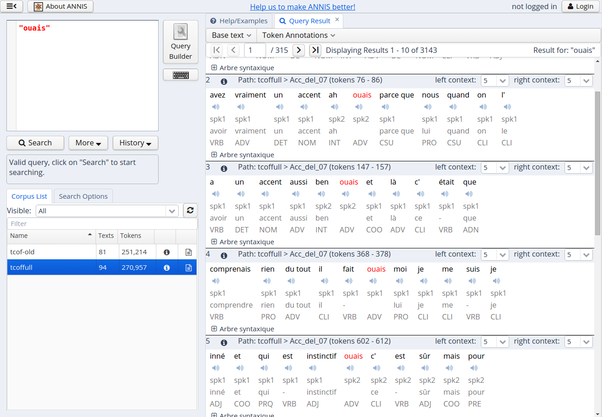
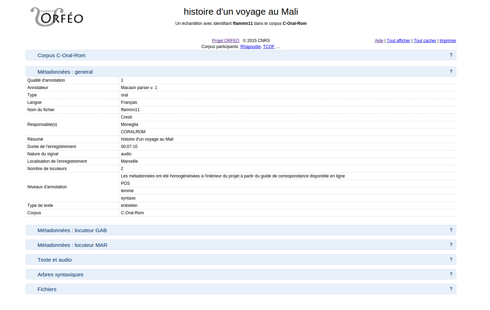
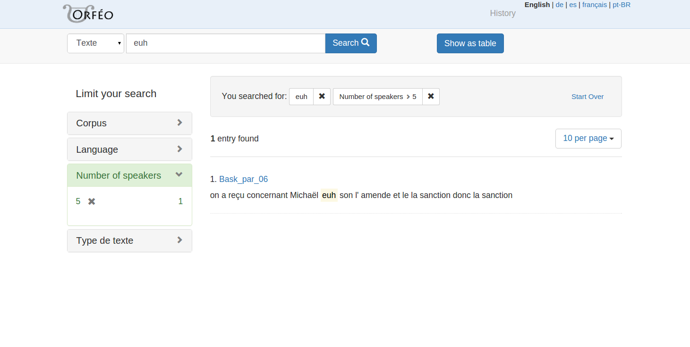
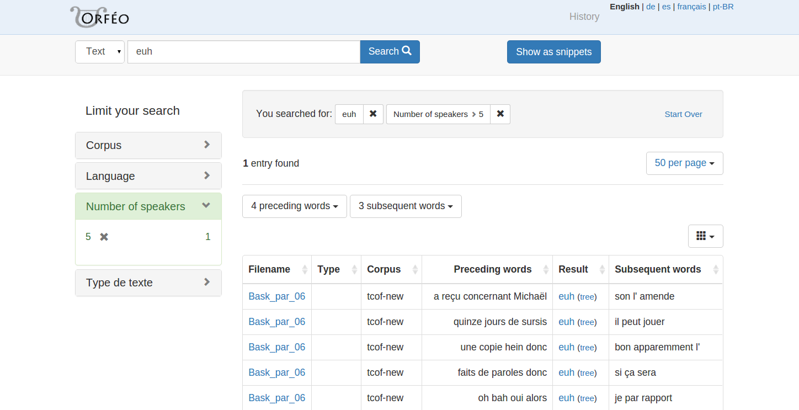

# The user inteface

The interface of the Orfeo search application is a loose confederation of three distinct tools.

*Structural search* is provided using [ANNIS](http://annis-tools.org/) (with minor modifications specific to project Orfeo):

*Sample pages* provide a view to each sample, with a summary of the metadata as well as a text-aligned audio player (for spoken corpora) and syntactic trees for all the locutions in the text:

The *text search* provides a search interface into the corpora, powered by [Apache Solr](http://lucene.apache.org/solr/) (using the [Blacklight](http://projectblacklight.org/) library), with a faceted browser for filtering by metadata values. The result view shows short text snippets for each matching sample, much like Google search:

Alternatively, the results may be viewed in a table (a *concordance* view), in which each line corresponds to a single occurrence of the search term:

The integration between the three tools is rather limited, essentially in the form of links from search results to sample pages and vice versa. The two search applications have their own advantages and drawbacks, e.g. using the syntax tree as part of the query is possible in structural search, while text search allows for easy combination of metadata constraints on a query.
